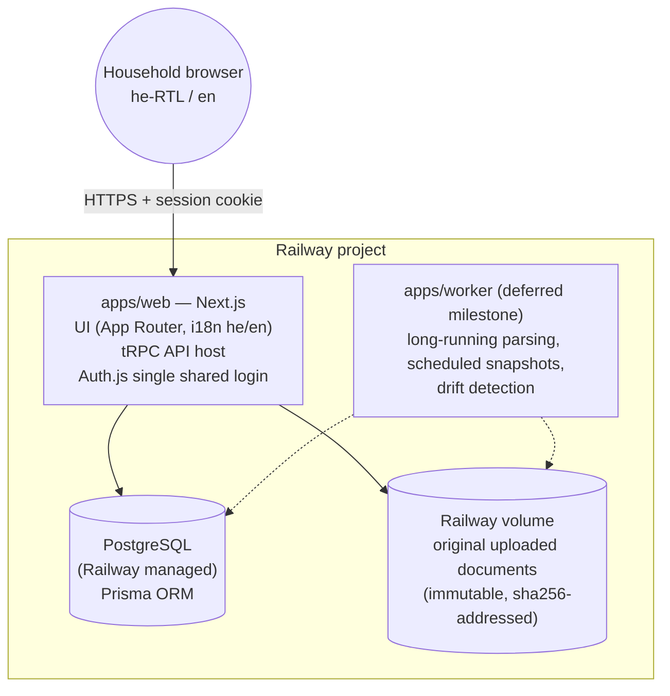
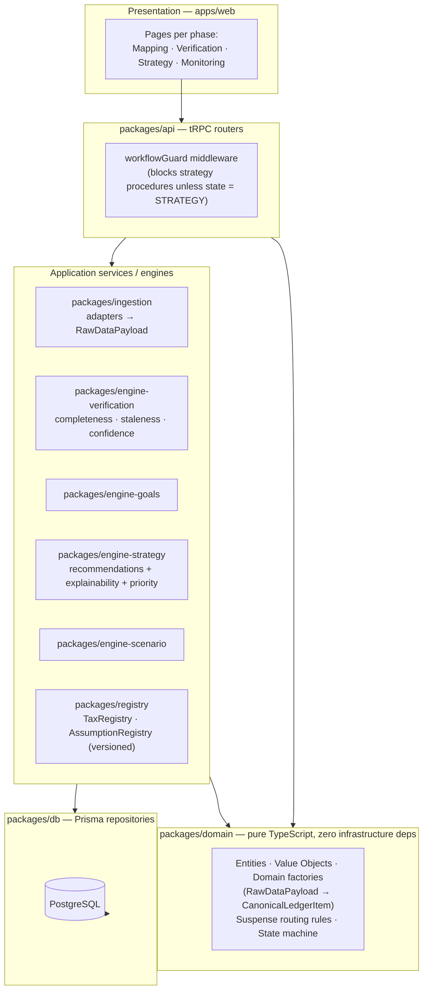
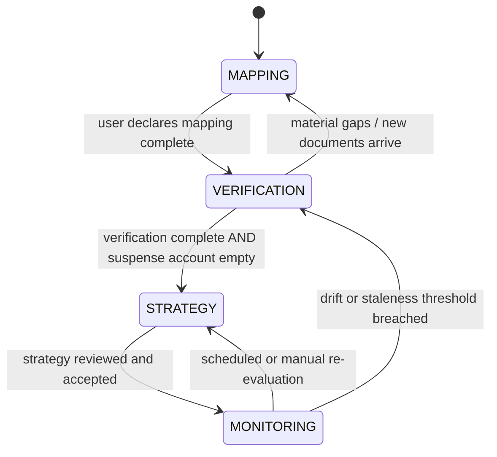
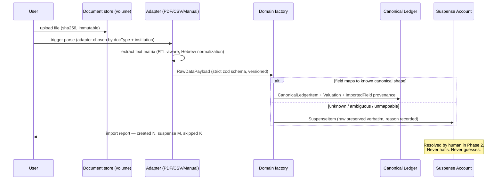
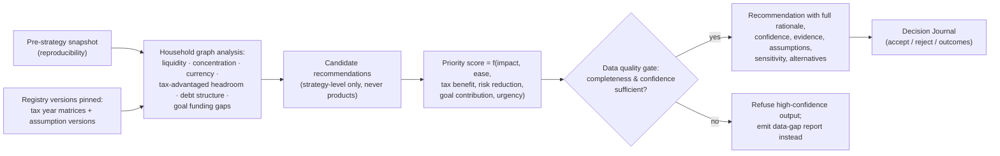

# 01 — System Architecture

## 1. Overview

WealthOS is a self-hosted household wealth **strategy** operating system. It is a decision-support
system, not a trading/execution platform. The architecture is organized around one canonical
household domain model (single source of truth), a strict four-phase state machine, decoupled
ingestion adapters, versioned regulatory/assumption registries, and explainable strategy engines.

Guiding constraint: **every module reads from the canonical model; duplicate financial data is
prohibited; the Strategy Module is physically blocked unless `workflow_state = STRATEGY`.**

## 2. Container diagram (deployment: Railway)

Notes:
- v1 ships as **one deployable** (Next.js) + Postgres + volume. The worker is introduced only when
  parsing/monitoring jobs outgrow request lifecycles (roadmap M9); until then jobs run in-process.
- Original documents are stored immutably on a volume, addressed by sha256; the DB stores metadata
  and provenance only. Every imported value stays traceable to its source file forever.
- No third-party data egress. No bank connectivity in v1 (out of scope by design).

## 3. Logical architecture — clean layering

Dependency rule (enforced by lint boundaries, see doc 04): arrows only point downward.
`packages/domain` imports nothing but `zod`. Ingestion adapters never import Prisma; they emit
`RawDataPayload` and hand off to the domain factory.

## 4. Phase state machine (product behavior)

Enforcement is **schema-driven**: `Household.workflowState` is a DB enum; every transition is
persisted to `WorkflowTransition` (audit); tRPC `workflowGuard` middleware rejects any strategy or
scenario procedure when state ≠ `STRATEGY`. Phase gating is enforced at the API boundary, not by
UI convention.

## 5. Ingestion pipeline (Adapter Pattern + Suspense Routing)

Provenance invariant: every imported field persists source document, original value, original
currency, import date, confidence, verification status, and last update — no exceptions.

## 6. Strategy generation flow (explainability-first)

Reproducibility invariant: a recommendation records the snapshot id, engine version, tax registry
version, and assumption versions it was computed from. Re-running with identical inputs yields
identical outputs. Changing an assumption automatically invalidates dependent recommendations.

## 7. Cross-cutting concerns

| Concern | Approach |
|---|---|
| i18n / RTL | `next-intl`, locale-per-route (`/he`, `/en`), `dir` derived from locale, Tailwind logical properties (`ms-`/`me-`), all strings in message catalogs from commit one |
| Money | `Decimal(18,4)` + ISO-4217 code value object; FX conversions store rate, rate date, source; never floats |
| Auth | Auth.js credentials provider, one household user, argon2 hash, secure session cookie |
| Auditability | Append-only `AuditEvent` for every mutation; append-only `Valuation` history; `WorkflowTransition` log |
| Reproducibility | Versioned engines, pinned registry versions, pre-strategy `HouseholdSnapshot` |
| Testing | Unit tests for all domain factories, engines, registries; integration tests over Prisma with a test DB; fixture corpus for adapters |
| Backups | Railway Postgres backups + periodic logical dump of DB and document volume (see risks doc) |

<!-- END OF DOCUMENT 01 -->
